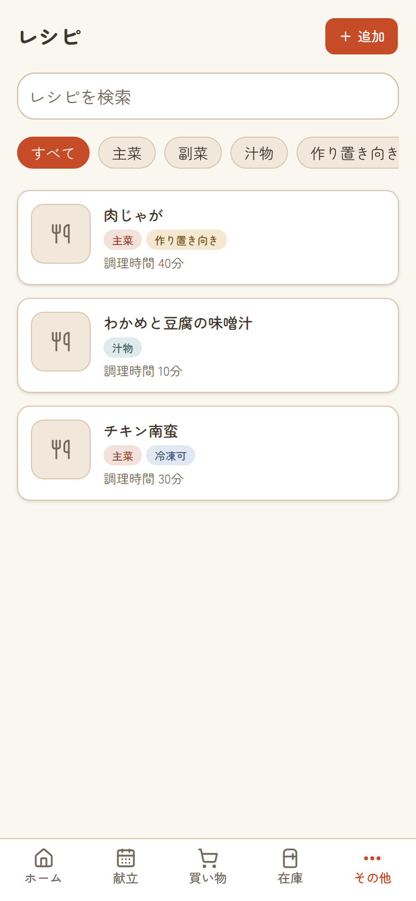
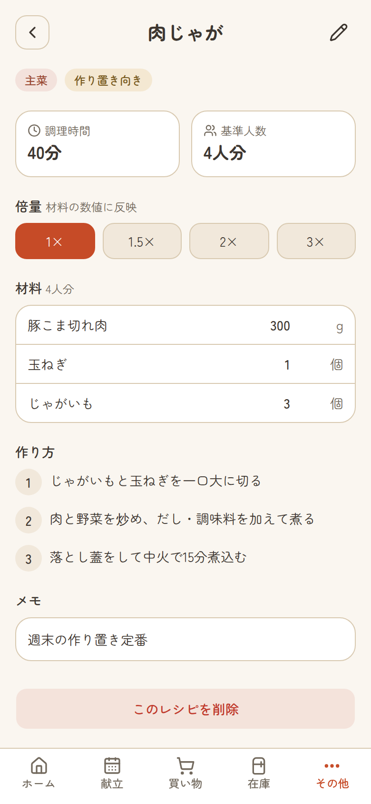
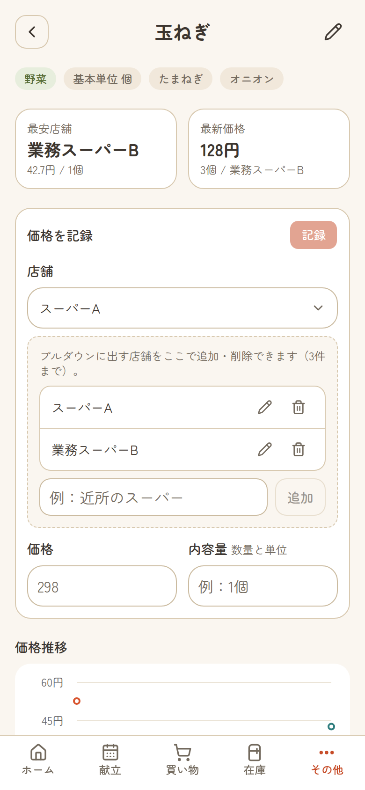
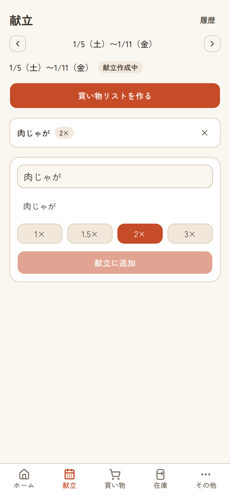
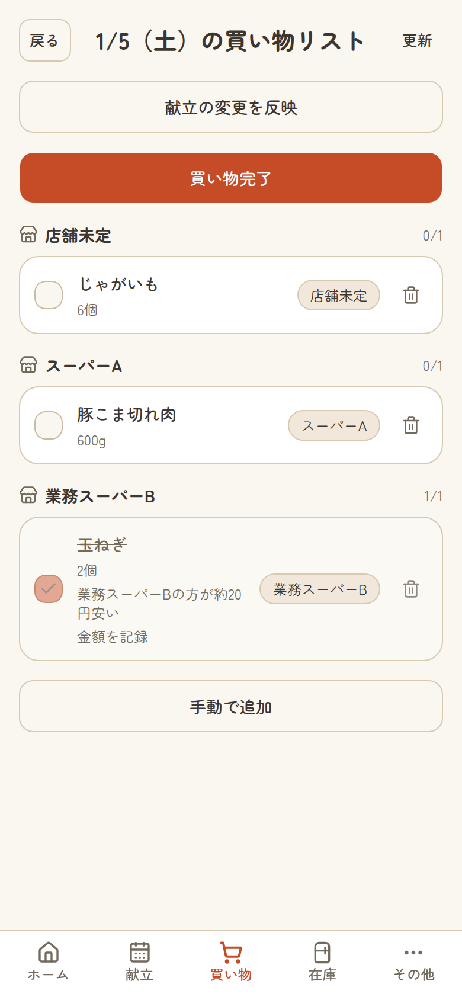
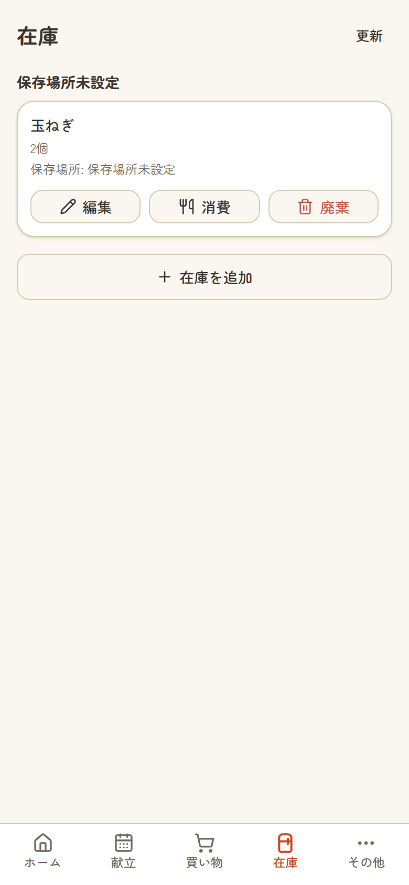

# Cookpit

[](https://github.com/oze-xxbumpxx/cookpit/actions/workflows/ci.yml)


毎週の作り置き運用を支える、献立・買い物・在庫管理の Web アプリ。

紙のレシピブックの限界、複数店舗の価格比較の手間、在庫の見える化という日常の困りごとを、
Clean Architecture + DDD の実践と両立させて解決する**個人開発プロジェクト**です。

## 画面

土曜日の運用フロー（献立を決める → 買い物リストを作る → 買い物する → 在庫になる）を、
スマートフォンの 1 画面で完結させることを狙った PWA です。

| レシピ一覧                                            | レシピ詳細（倍量計算）                                      | 価格比較・価格推移                                                   |
| ----------------------------------------------------- | ----------------------------------------------------------- | -------------------------------------------------------------------- |
|  |  |  |

| 献立作成（倍量指定）                                  | 買い物リスト（店舗別・最安店舗バッジ）                        | 在庫                                           |
| ----------------------------------------------------- | ------------------------------------------------------------- | ---------------------------------------------- |
|  |  |  |

> スクリーンショットはシード済みのローカル DB に対して
> [`apps/web/scripts/capture-screenshots.mjs`](apps/web/scripts/capture-screenshots.mjs)
> で自動生成しています（手動撮影ではないため、画面変更時に撮り直せます）。

## このリポジトリについて

**ソースコードは公開する前提ですが、アプリ自体は不特定多数へ提供しません。**
利用者は開発者本人とパートナーの 2 名のみで、本番デプロイはログイン認証（Better Auth の
email + password + Cookie セッション）で保護し、アカウントは開発者が 2 名分だけ発行します。
経緯は [ADR-0023](./docs/decisions/ADR-0023-better-auth-login.md)（Basic 認証からの移行）と
[ADR-0021](./docs/decisions/ADR-0021-basic-auth-for-public-repository.md)（公開時の保護）を参照してください。

公開の目的は、Clean Architecture + DDD のモノレポ構成と、Claude Code を中心とした
AI 支援開発のワークフロー（`.claude/` と `docs/claude-code/`）を、実例として残すことです。

## 技術スタック

| レイヤー         | 技術                                        |
| ---------------- | ------------------------------------------- |
| フロントエンド   | Next.js 16 (App Router) + React 19          |
| バックエンド API | Hono（Next.js 内にマウント）                |
| API 通信         | Hono RPC（型安全）                          |
| ORM / DB         | Drizzle ORM + Neon (Serverless PostgreSQL)  |
| バリデーション   | Zod（`packages/api-contract` で契約を共有） |
| スタイリング     | Tailwind CSS v4 + shadcn/ui                 |
| PWA              | Serwist                                     |
| テスト           | Vitest（全層）+ Playwright（E2E スモーク）  |
| モノレポ         | Turborepo + pnpm workspaces                 |
| デプロイ         | Vercel                                      |

選定理由は [docs/02-tech-stack.md](./docs/02-tech-stack.md) にあります。

## アーキテクチャ

依存方向は `Presentation → Application → Domain ← Infrastructure` の一方向です。
`packages/domain` は他のどのパッケージにも依存しません。

```
apps/
  web/                  Next.js App Router + 内マウントの Hono（Presentation）
packages/
  domain/               Entity / Value Object / Repository インターフェース
  application/          UseCase / DTO
  infrastructure/       Drizzle による Repository 実装・DB スキーマ
  api-contract/         Zod スキーマ（API 契約）
  config/               共有設定
```

詳細は [docs/03-architecture.md](./docs/03-architecture.md)、
ドメインモデルは [docs/04-domain-model.md](./docs/04-domain-model.md) を参照してください。

## はじめて読む方へ（おすすめの入口）

ドキュメントが 400 ファイルを超えているため、短時間で設計の勘所を掴むための入口を示します。

**設計の考え方を知りたい場合**（各 5 分程度）

| ドキュメント                                                               | 読みどころ                                                                 |
| -------------------------------------------------------------------------- | -------------------------------------------------------------------------- |
| [ADR-0002](./docs/decisions/ADR-0002-nextjs-hono-mounted.md)               | Next.js の中に Hono をマウントした理由。API を別プロセスに切り出さない判断 |
| [ADR-0019](./docs/decisions/ADR-0019-db-transaction-uow.md)                | 集約をまたぐ書き込みを Unit of Work でどう束ねたか                         |
| [ADR-0006](./docs/decisions/ADR-0006-shopping-list-generate-idempotent.md) | 買い物リスト生成を冪等にするための制約設計                                 |

**コードを読みたい場合**

| ファイル                                                                                                                                               | 読みどころ                                                                 |
| ------------------------------------------------------------------------------------------------------------------------------------------------------ | -------------------------------------------------------------------------- |
| [`packages/domain/src/shopping-list/shopping-list.ts`](./packages/domain/src/shopping-list/shopping-list.ts)                                           | 本プロジェクトで最も状態遷移が多い集約。不変条件を Entity に閉じ込めている |
| [`packages/application/src/shopping-list/reopen-shopping-list.use-case.ts`](./packages/application/src/shopping-list/reopen-shopping-list.use-case.ts) | 1 ユースケース = 1 クラス・手動 DI・型付きエラーの実例                     |
| [`apps/web/src/server/app.ts`](./apps/web/src/server/app.ts)                                                                                           | Application 層のエラー基底 2 種だけで HTTP へ変換する仕組み                |

**AI 支援開発のワークフローに関心がある場合**

[`docs/claude-code/`](./docs/claude-code/) が正典です。Subagent への工程分割、変更レベル
（L1〜L3）に応じた成果物の出し分け、失敗から改善候補を起票する仕組みを記録しています。
うまくいった記録だけでなく、**判断を誤った記録も
[`improvements/`](./docs/claude-code/improvements/) にそのまま残しています**。

## ローカルでの動かし方

前提: Node.js 20 以上 / pnpm 10 以上。

```bash
pnpm install

# DB を用意せずに動かす場合（PGlite をローカルに生成して起動）
pnpm --filter @cookpit/web dev:pglite

# Neon など実 PostgreSQL を使う場合
cp apps/web/.env.example apps/web/.env   # DATABASE_URL を設定する
pnpm dev
```

`BETTER_AUTH_SECRET` は未設定でも開発時は認証がスキップされるため、ローカル開発で設定する
必要はありません（生成する場合は `openssl rand -base64 32`）。設定した場合は `pnpm dev` でも
ログイン画面が挟まります。本番相当（`NODE_ENV=production`）で未設定の場合は fail-closed で
503 を返します。ログイン E2E（`auth-login.spec.ts`）の実行手順は
[`apps/web/e2e/README.md`](apps/web/e2e/README.md) を参照してください。

### 品質ゲート

```bash
pnpm lint
pnpm type-check
pnpm test           # Vitest（全 2,355 件）
pnpm test:coverage  # カバレッジ計測（coverage/ に出力）
pnpm build
```

### テストとカバレッジ

Vitest を全層に導入しています。ビジネスロジックの境界値・異常系は各層の Vitest が担い、
Playwright は画面・API・DB をまたぐ主要導線の配線確認に絞っています。

| パッケージ                | テスト数 | Statements | Branches |
| ------------------------- | -------: | ---------: | -------: |
| `packages/domain`         |      456 |     97.36% |   96.49% |
| `packages/application`    |      432 |     98.73% |   94.21% |
| `packages/api-contract`   |      293 |       100% |     100% |
| `packages/infrastructure` |      126 |     85.75% |   88.08% |
| `apps/web`                |    1,048 |     85.13% |   78.82% |

`packages/infrastructure` は PGlite による実 DB テスト、`apps/web` は Hono ルートの結合
テストと React Testing Library によるコンポーネントテストです。

CI（[`.github/workflows/ci.yml`](.github/workflows/ci.yml)）では上記に加えて、
E2E スモークを**未実行のまま成功扱いにしない**検証（`assert-e2e-results.mjs` が
「2 件以上実行され全件成功」を確認）と、依存パッケージの脆弱性監査を実行しています。

## ドキュメント

設計判断の経緯は ADR に残しています。一覧は
[docs/decisions/README.md](./docs/decisions/README.md) を参照してください。

| 場所                                          | 内容                                                             |
| --------------------------------------------- | ---------------------------------------------------------------- |
| [docs/](./docs/)                              | 概要・技術スタック・アーキテクチャ・ドメインモデル・ロードマップ |
| [docs/decisions/](./docs/decisions/README.md) | ADR（アーキテクチャ意思決定記録）の一覧                          |
| [docs/designs/](./docs/designs/)              | 機能ごとの設計書                                                 |
| [docs/claude-code/](./docs/claude-code/)      | AI 支援開発のワークフロー・Agent 責務・改善サイクル              |
| [.claude/](./.claude/)                        | Claude Code の Agent 定義・Skill・Hook・Rule                     |
| [logs/](./logs/)                              | 日次の作業ログ                                                   |

## ライセンス

**All Rights Reserved（全権利留保）** です。詳細は [LICENSE](./LICENSE) を参照してください。

閲覧と参考にしていただくのは歓迎しますが、複製・改変・再配布・商用利用の許諾はしていません。
OSS ライセンスを付けていないのは設定漏れではなく、意図的な選択です。

利用をご希望の場合は Issue でご相談ください。

## コントリビューション

個人の家庭内利用を目的としたプロジェクトのため、機能追加の Pull Request は受け付けていません。
バグや気づいた点の Issue は歓迎します。
