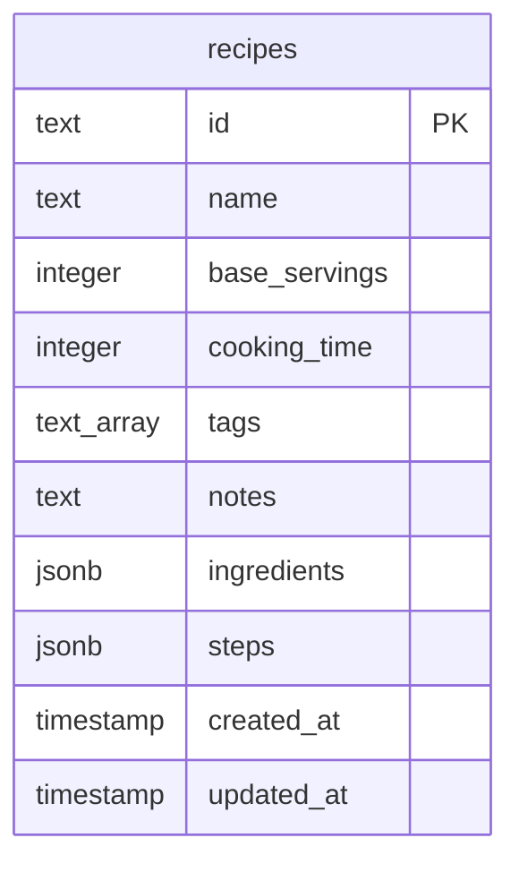
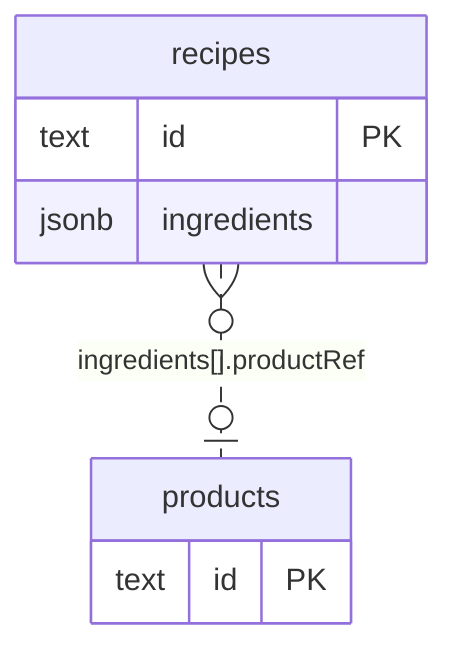

# Sprint 1 Drizzle スキーマ実装計画

## 目的

Recipe 集約を PostgreSQL に永続化できるようにするため、Drizzle ORM のスキーマとして `recipes` テーブルを定義する。

Sprint 1 では紙のレシピをデジタル化し、後続の Repository 実装・Recipe CRUD 実装につなげることを優先する。そのため、この計画では DB 永続化の最小単位として Recipe 集約のみを扱う。

Recipe 集約の `ingredients` と `steps` は Recipe なしには存在しない値オブジェクトであり、常に Recipe 単位で読み書きする。MVP1 では検索・集計よりも実装の単純さと集約単位の取得を優先し、別テーブルに分割せず `jsonb` カラムに配列として保存する。

## ゴール

- `apps/web/src/db/schema.ts` に `recipes` テーブルを定義する。
- `RecipeRow` / `NewRecipeRow` を export し、後続の Repository 実装から利用できるようにする。
- `pnpm db:generate` で migration SQL を生成する。
- 生成された migration SQL を確認する。
- `pnpm db:migrate` で DB に migration を適用する。
- 実装後、Claude Code にレビューを依頼する。

## スコープ

### 対象

- `apps/web/src/db/schema.ts`
- `recipes` テーブル定義
- `RecipeRow` / `NewRecipeRow` 型 export
- Drizzle migration 生成・適用

### 対象外

- Recipe Repository 実装
- Hono API 実装
- UI 実装
- Product / MealPlan / ShoppingList / Pantry のスキーマ実装
- JSONB 内部構造の DB レベル制約
- `base_servings > 0` / `cooking_time >= 0` の CHECK 制約追加

値の不変条件は Sprint 1 時点では Domain 層の `Recipe.create()` / `Recipe.reconstruct()` および Value Object 側で担保する。

## 作成テーブル

作成するテーブルは `recipes` の 1 つ。

| カラム名        | Drizzle プロパティ | 型          | 制約                     | 説明                                           |
| --------------- | ------------------ | ----------- | ------------------------ | ---------------------------------------------- |
| `id`            | `id`               | `text`      | PRIMARY KEY              | UUID 文字列。Domain 層の `RecipeId` で採番する |
| `name`          | `name`             | `text`      | NOT NULL                 | レシピ名                                       |
| `base_servings` | `baseServings`     | `integer`   | NOT NULL                 | 基準人数                                       |
| `cooking_time`  | `cookingTime`      | `integer`   | NULL 許容                | 調理時間。分単位                               |
| `tags`          | `tags`             | `text[]`    | NOT NULL, DEFAULT `'{}'` | レシピタグ配列                                 |
| `notes`         | `notes`            | `text`      | NOT NULL, DEFAULT `''`   | メモ                                           |
| `ingredients`   | `ingredients`      | `jsonb`     | NOT NULL, DEFAULT `'[]'` | 材料配列                                       |
| `steps`         | `steps`            | `jsonb`     | NOT NULL, DEFAULT `'[]'` | 手順配列                                       |
| `created_at`    | `createdAt`        | `timestamp` | NOT NULL, DEFAULT NOW()  | 作成日時                                       |
| `updated_at`    | `updatedAt`        | `timestamp` | NOT NULL, DEFAULT NOW()  | 更新日時。更新時はアプリ側で更新する           |

## JSONB 格納構造

`jsonb` の内部構造は DB では強制しない。Repository 実装時に以下の構造へ変換する。

### `ingredients`

```typescript
type IngredientRow = {
  productRef: string | null;
  displayName: string;
  amountValue: number | null;
  amountUnit: string | null;
  amountNote: string | null;
};
```

各フィールドの意味は以下。

| フィールド    | 説明                                                  |
| ------------- | ----------------------------------------------------- |
| `productRef`  | ProductId の UUID 文字列。Product 未紐付けなら `null` |
| `displayName` | レシピ上の材料表示名                                  |
| `amountValue` | 数値量。`amountNote` と排他                           |
| `amountUnit`  | 単位。`amountValue` が `null` の場合は `null`         |
| `amountNote`  | 「少々」「適量」など、数値化しない量の表現            |

### `steps`

```typescript
type StepRow = {
  description: string;
};
```

手順の順序は `steps` 配列のインデックス順で管理する。`order` フィールドは持たない。

## テーブルの関係図

今回の migration で実際に作成するのは `recipes` テーブルのみ。



Recipe 集約は将来的に Product 集約を ID 参照するが、今回の DB スキーマでは外部キーを作成しない。`ingredients` 内の `productRef` は nullable な ProductId 文字列として JSONB に保存する。



## 実装コード

`apps/web/src/db/schema.ts` の既存内容を以下に置き換える。

```typescript
import { integer, jsonb, pgTable, text, timestamp } from 'drizzle-orm/pg-core';

export const recipes = pgTable('recipes', {
  id: text('id').primaryKey(),
  name: text('name').notNull(),
  baseServings: integer('base_servings').notNull(),
  cookingTime: integer('cooking_time'),
  tags: text('tags').array().notNull().default([]),
  notes: text('notes').notNull().default(''),
  ingredients: jsonb('ingredients').notNull().default([]),
  steps: jsonb('steps').notNull().default([]),
  createdAt: timestamp('created_at').notNull().defaultNow(),
  updatedAt: timestamp('updated_at').notNull().defaultNow(),
});

export type RecipeRow = typeof recipes.$inferSelect;
export type NewRecipeRow = typeof recipes.$inferInsert;
```

## 実装手順

1. `apps/web/src/db/schema.ts` を開く。
2. 既存の接続確認用 `export const schema = {};` を削除する。
3. `drizzle-orm/pg-core` から `integer`, `jsonb`, `pgTable`, `text`, `timestamp` を import する。
4. `recipes` テーブル定義を追加する。
5. `RecipeRow` / `NewRecipeRow` を export する。
6. `apps/web` で migration を生成する。

```bash
pnpm db:generate
```

7. `apps/web/src/db/migrations/` に生成された SQL を確認する。
8. `apps/web` で migration を適用する。

```bash
pnpm db:migrate
```

9. 実装差分と migration 結果を Claude Code にレビュー依頼する。

## 完了条件

- `apps/web/src/db/schema.ts` に `recipes` テーブルが定義されている。
- `RecipeRow` / `NewRecipeRow` が export されている。
- migration SQL が生成されている。
- migration がエラーなく適用されている。
- Claude Code レビュー前の実装結果が整理されている。
