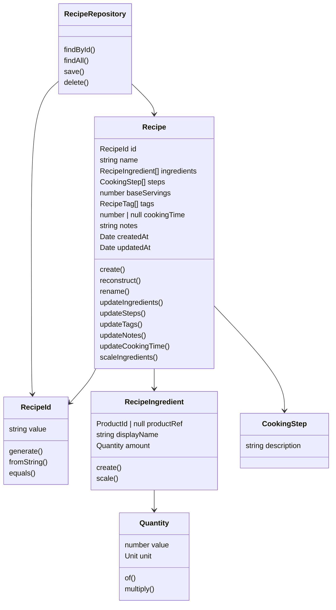

# Sprint 1 Recipe ドメイン層 実装ガイド

## 目標

Sprint 1 では、`packages/domain` に Recipe 集約のドメインモデルを実装する。

この時点では UI / API / DB 実装には入らず、Clean Architecture の中心である Domain 層だけを完成させる。

完了時点で、以下が満たされていることを目標とする。

- Recipe 集約を TypeScript の純粋なクラスとして表現できている
- Recipe の生成・復元・更新・材料スケール計算ができる
- Domain 層が他パッケージに依存していない
- 後続の Application / Infrastructure 層から利用できる Repository Interface が定義されている
- Domain 層のユニットテストを追加できる状態になっている

## 目的

Recipe は MVP1 の最初の実利用対象である。

紙のレシピをアプリに転記し始められる状態を Sprint 1 の最終成果とするため、まずは Recipe 集約の振る舞いと不変条件を Domain 層に閉じ込める。

Domain 層では以下を守る。

- Entity の生成は `static create()` を通す
- DB からの復元は `static reconstruct()` を通す
- Drizzle / Hono / Next.js / React の型を持ち込まない
- 集約外の Product はインスタンス参照せず、ID 参照だけにする
- レシピ上の材料名と Product マスタ名は別物として扱う
- ドメインロジックは Entity / Value Object に置き、UseCase や Repository に逃がさない

## Lint / Format 前提

Sprint 1 では Lint / Format ルールが厳格化されている。

Recipe ドメイン層の実装では、`packages/domain` に適用される共通 ESLint 設定と、ルートの Prettier 設定に従う。

### Prettier ルール

ルートの `.prettierrc` により、以下のフォーマットに統一する。

```json
{
  "singleQuote": true,
  "semi": true,
  "printWidth": 100,
  "trailingComma": "all"
}
```

実装時の注意:

- 文字列は single quote を使う
- セミコロンを付ける
- 1 行は原則 100 文字以内に収める
- 複数行の引数・配列・オブジェクトでは trailing comma を付ける

### ESLint ルール

`packages/config/eslint/base.mjs` の共通設定により、Domain 層では以下を守る。

| ルール                                       | 扱い  | 実装時の方針                                     |
| -------------------------------------------- | ----- | ------------------------------------------------ |
| `@typescript-eslint/no-explicit-any`         | error | `any` は使わず、必要なら `unknown` を使う        |
| `@typescript-eslint/consistent-type-imports` | error | 型だけの import は必ず `import type` にする      |
| `@typescript-eslint/no-unused-vars`          | error | 未使用の変数・引数・型を残さない                 |
| `eqeqeq`                                     | error | `==` / `!=` は使わず、`===` / `!==` を使う       |
| `@typescript-eslint/no-non-null-assertion`   | warn  | `!` は原則使わず、分岐やバリデーションで絞り込む |
| `no-console`                                 | warn  | Domain 層に `console.log` を残さない             |

未使用引数は `_` プレフィックスで除外されるが、Domain 層では原則として不要な引数を定義しない。

## 実装コード

作成対象は以下。

```text
packages/domain/src/
├── shared/
│   ├── unit.ts
│   └── quantity.ts
└── recipe/
    ├── recipe-id.ts
    ├── cooking-step.ts
    ├── recipe-ingredient.ts
    ├── recipe.repository.ts
    └── recipe.ts
```

### `shared/unit.ts`

```ts
export type Unit = 'g' | 'kg' | 'ml' | 'l' | 'tsp' | 'tbsp' | 'cup' | 'piece' | 'pinch';
```

### `shared/quantity.ts`

`Quantity` は数量と単位を表す値オブジェクト。

```ts
import type { Unit } from './unit';

export class Quantity {
  private constructor(
    private readonly quantityValue: number,
    private readonly quantityUnit: Unit,
  ) {}

  static of(value: number, unit: Unit): Quantity {
    if (value < 0) {
      throw new Error('Quantity must be non-negative');
    }

    return new Quantity(value, unit);
  }

  multiply(factor: number): Quantity {
    return Quantity.of(this.quantityValue * factor, this.quantityUnit);
  }

  get value(): number {
    return this.quantityValue;
  }

  get unit(): Unit {
    return this.quantityUnit;
  }
}
```

実装ルール:

- `static of(value, unit)` で生成する
- `value < 0` の場合は `Error` を投げる
- `multiply(factor)` は新しい `Quantity` を返し、元のインスタンスは変更しない
- `multiply(factor)` で結果が負になる場合も `Error` とする

### `recipe/recipe-id.ts`

`RecipeId` は Recipe 集約の識別子を表す値オブジェクト。

```ts
export class RecipeId {
  private constructor(private readonly recipeIdValue: string) {}

  static generate(): RecipeId {
    return new RecipeId(crypto.randomUUID());
  }

  static fromString(value: string): RecipeId {
    return new RecipeId(value);
  }

  equals(other: RecipeId): boolean {
    return this.recipeIdValue === other.value;
  }

  get value(): string {
    return this.recipeIdValue;
  }
}
```

実装ルール:

- `generate()` は `crypto.randomUUID()` で ID を採番する
- `fromString(value)` は既存 ID の復元に使う
- `equals(other)` は `value` 同士を比較する

### `recipe/cooking-step.ts`

`CookingStep` は調理手順を表す値オブジェクト。

```ts
export class CookingStep {
  public constructor(public readonly description: string) {
    if (description.trim() === '') {
      throw new Error('Cooking step description is required');
    }
  }
}
```

実装ルール:

- `order` フィールドは持たせない
- 手順の順序は `Recipe.steps` 配列のインデックス順を正とする
- `description.trim() === ''` の場合は `Error` を投げる

### `recipe/recipe-ingredient.ts`

`RecipeIngredient` はレシピ内の材料を表す値オブジェクト。

```ts
import type { Quantity } from '../shared/quantity';

export interface ProductId {
  readonly value: string;
}

export class RecipeIngredient {
  private constructor(
    private readonly productReference: ProductId | null,
    private readonly ingredientDisplayName: string,
    private readonly ingredientAmount: Quantity,
  ) {}

  static create(props: {
    productRef: ProductId | null;
    displayName: string;
    amount: Quantity;
  }): RecipeIngredient {
    if (props.displayName.trim() === '') {
      throw new Error('Recipe ingredient display name is required');
    }

    return new RecipeIngredient(props.productRef, props.displayName, props.amount);
  }

  scale(factor: number): RecipeIngredient {
    return new RecipeIngredient(
      this.productReference,
      this.ingredientDisplayName,
      this.ingredientAmount.multiply(factor),
    );
  }

  get productRef(): ProductId | null {
    return this.productReference;
  }

  get displayName(): string {
    return this.ingredientDisplayName;
  }

  get amount(): Quantity {
    return this.ingredientAmount;
  }
}
```

実装ルール:

- `ProductId` は Sprint 1 時点では Product 集約未実装のため、このファイル内でローカル定義する
- `productRef` がある場合でも `displayName` は必ず持つ
- `displayName` は「レシピ上の呼び方」として扱う
- `productRef` は「Product 集約への接続点」として扱う
- `displayName.trim() === ''` の場合は `Error` を投げる
- `scale(factor)` は `amount.multiply(factor)` した新しい `RecipeIngredient` を返す

### `recipe/recipe.repository.ts`

Repository は Interface のみ定義する。実装は Infrastructure 層で行う。

```ts
import type { Recipe } from './recipe';
import type { RecipeId } from './recipe-id';

export interface RecipeRepository {
  findById(id: RecipeId): Promise<Recipe | null>;
  findAll(): Promise<Recipe[]>;
  save(recipe: Recipe): Promise<void>;
  delete(id: RecipeId): Promise<void>;
}
```

### `recipe/recipe.ts`

`Recipe` は Recipe 集約の集約ルート。

```ts
import type { CookingStep } from './cooking-step';
import type { RecipeIngredient } from './recipe-ingredient';
import { RecipeId } from './recipe-id';

export type RecipeTag = '主菜' | '副菜' | '汁物' | '作り置き向き' | '冷凍可';
```

```ts
export interface CreateRecipeInput {
  name: string;
  ingredients: RecipeIngredient[];
  steps: CookingStep[];
  baseServings: number;
  tags?: RecipeTag[];
  cookingTime?: number | null;
  notes?: string;
}

export interface RecipeProps {
  id: RecipeId;
  name: string;
  ingredients: RecipeIngredient[];
  steps: CookingStep[];
  baseServings: number;
  tags: RecipeTag[];
  cookingTime: number | null;
  notes: string;
  createdAt: Date;
  updatedAt: Date;
}
```

実装するフィールド:

| フィールド       | 型                   | readonly |
| ---------------- | -------------------- | -------- |
| `recipeId`       | `RecipeId`           | yes      |
| `recipeName`     | `string`             | no       |
| `ingredientList` | `RecipeIngredient[]` | no       |
| `cookingSteps`   | `CookingStep[]`      | no       |
| `servings`       | `number`             | no       |
| `recipeTags`     | `RecipeTag[]`        | no       |
| `cookingMinutes` | `number \| null`     | no       |
| `recipeNotes`    | `string`             | no       |
| `createdDate`    | `Date`               | yes      |
| `updatedDate`    | `Date`               | no       |

実装するメソッド:

```ts
export class Recipe {
  private constructor(
    private readonly recipeId: RecipeId,
    private recipeName: string,
    private ingredientList: RecipeIngredient[],
    private cookingSteps: CookingStep[],
    private servings: number,
    private recipeTags: RecipeTag[],
    private cookingMinutes: number | null,
    private recipeNotes: string,
    private readonly createdDate: Date,
    private updatedDate: Date,
  ) {}

  static create(input: CreateRecipeInput): Recipe {
    if (input.name.trim() === '') {
      throw new Error('Recipe name is required');
    }

    if (input.baseServings <= 0) {
      throw new Error('Recipe base servings must be positive');
    }

    if (input.cookingTime !== null && input.cookingTime !== undefined && input.cookingTime < 0) {
      throw new Error('Recipe cooking time must be non-negative');
    }

    const now = new Date();

    return new Recipe(
      RecipeId.generate(),
      input.name,
      [...input.ingredients],
      [...input.steps],
      input.baseServings,
      [...(input.tags ?? [])],
      input.cookingTime ?? null,
      input.notes ?? '',
      now,
      now,
    );
  }

  static reconstruct(props: RecipeProps): Recipe {
    return new Recipe(
      props.id,
      props.name,
      [...props.ingredients],
      [...props.steps],
      props.baseServings,
      [...props.tags],
      props.cookingTime,
      props.notes,
      new Date(props.createdAt),
      new Date(props.updatedAt),
    );
  }

  rename(name: string): void {
    if (name.trim() === '') {
      throw new Error('Recipe name is required');
    }

    this.recipeName = name;
    this.touch();
  }

  updateIngredients(ingredients: RecipeIngredient[]): void {
    this.ingredientList = [...ingredients];
    this.touch();
  }

  updateSteps(steps: CookingStep[]): void {
    this.cookingSteps = [...steps];
    this.touch();
  }

  updateTags(tags: RecipeTag[]): void {
    this.recipeTags = [...tags];
    this.touch();
  }

  updateNotes(notes: string): void {
    this.recipeNotes = notes;
    this.touch();
  }

  updateCookingTime(minutes: number | null): void {
    if (minutes !== null && minutes < 0) {
      throw new Error('Recipe cooking time must be non-negative');
    }

    this.cookingMinutes = minutes;
    this.touch();
  }

  scaleIngredients(scaleFactor: number): RecipeIngredient[] {
    return this.ingredientList.map((ingredient) => ingredient.scale(scaleFactor));
  }

  get id(): RecipeId {
    return this.recipeId;
  }

  get name(): string {
    return this.recipeName;
  }

  get ingredients(): RecipeIngredient[] {
    return [...this.ingredientList];
  }

  get steps(): CookingStep[] {
    return [...this.cookingSteps];
  }

  get baseServings(): number {
    return this.servings;
  }

  get tags(): RecipeTag[] {
    return [...this.recipeTags];
  }

  get cookingTime(): number | null {
    return this.cookingMinutes;
  }

  get notes(): string {
    return this.recipeNotes;
  }

  get createdAt(): Date {
    return new Date(this.createdDate);
  }

  get updatedAt(): Date {
    return new Date(this.updatedDate);
  }

  private touch(): void {
    this.updatedDate = new Date();
  }
}
```

生成・復元ルール:

- `create(input)` は新規作成用
- `create(input)` では `name.trim() === ''` の場合に `Error` を投げる
- `create(input)` では `baseServings <= 0` の場合に `Error` を投げる
- `create(input)` では `RecipeId.generate()` で ID を採番する
- `tags` のデフォルト値は `[]`
- `cookingTime` のデフォルト値は `null`
- `notes` のデフォルト値は `''`
- `createdAt` / `updatedAt` は `new Date()`
- `reconstruct(props)` は DB 復元用なので、原則バリデーションせずそのまま復元する

更新ルール:

- 更新系メソッドでは必ず `updatedDate = new Date()` を実行する
- `rename(name)` は `name.trim() === ''` の場合に `Error` を投げる
- `updateCookingTime(minutes)` は `minutes !== null && minutes < 0` の場合に `Error` とする
- `scaleIngredients(scaleFactor)` は `ingredientList` を変更せず、新しい配列を返す

## 関係図



## 気をつけなければいけないこと

- Domain 層は他パッケージに依存しない
- Domain 層に Drizzle / Hono / HTTP / UI の型を持ち込まない
- `any` は使わない
- デフォルトエクスポートは禁止する
- 型のみの import は `import type` を使う
- 未使用の変数・引数・型を残さない
- `==` / `!=` は使わず、`===` / `!==` を使う
- non-null assertion の `!` は原則使わない
- Domain 層に `console.log` を残さない
- 値なしは `null` に統一する
- `CookingStep` に `order` は持たせない
- 手順の順序は `steps` 配列の順番を正とする
- `RecipeIngredient.displayName` は `productRef` がある場合も必ず持つ
- `RecipeTag` は自由文字列にしない
- `notes` は MVP1 ではプレーンテキストの `string` とする
- `reconstruct()` は DB 復元用なので、原則バリデーションしない
- 更新系メソッドでは必ず `updatedAt` を更新する
- `scaleIngredients()` は元の `ingredientList` を変更しない
- 配列を返す getter は内部配列の参照をそのまま返さず、コピーを返す

## つまづきそうなポイント

### 配列 getter の扱い

`ingredients` / `steps` / `tags` をそのまま返すと、外部から配列を変更できてしまう。

DDD 的にはコピーを返す方が安全。

```ts
get ingredients(): RecipeIngredient[] {
  return [...this.ingredientList];
}
```

`this.ingredients` を参照すると getter 自身を再帰的に呼んでしまうため、必ず内部フィールドの `this.ingredientList` を使う。

### ProductId の扱い

Sprint 1 では Product 集約が未実装のため、`ProductId` は `recipe-ingredient.ts` 内でローカル定義する。

後続 Sprint で Product 集約ができたら、共通の `ProductId` に差し替える可能性がある。

### `crypto.randomUUID()` の実行環境

`RecipeId.generate()` で `crypto.randomUUID()` を使う場合、テスト環境や TypeScript 設定によって `crypto` の型解決で詰まる可能性がある。

Node / DOM のどちらの `crypto` を前提にするかは、`tsconfig` と実行環境を確認する。

### `cookingTime` のバリデーション

仕様では `number | null` だが、負数を許す必要はない。

MVP1 では `minutes !== null && minutes < 0` をエラーにする。

### `Quantity.multiply()` の factor

`factor < 0` を許すと負の数量が作れてしまう。

`Quantity.of()` が `value < 0` を防ぐ設計なので、`multiply()` でも結果が負になる場合はエラーにする。

### `reconstruct()` のバリデーション

`create()` と違い、`reconstruct()` は永続化済みデータの復元用。

ここで強いバリデーションをすると、過去データの読み込みで落ちる可能性があるため、仕様どおりそのまま復元に寄せる。

### テストの置き場所

Domain 層はユニットテスト必須。

まだテスト構成が未確定なら、実装前に以下のどちらにするか決める。

- `packages/domain/src/**/*.test.ts`
- `packages/domain/tests/**/*.test.ts`

既存のパッケージ構成がある場合は、その構成に合わせる。

### `import type` の漏れ

共通 ESLint 設定で `@typescript-eslint/consistent-type-imports` が `error` になっている。

値として実行時に使わない型は、必ず `import type` で読み込む。

```ts
import type { Unit } from './unit';
import type { RecipeId } from './recipe-id';
```

クラスを `new RecipeId()` のように値として使う場合は通常 import が必要だが、Sprint 1 の設計では `RecipeId.generate()` や `RecipeId.fromString()` を同一ファイル外から呼ぶ箇所に注意する。

### 未使用定義の残置

共通 ESLint 設定で未使用変数は `error` になる。

実装途中のメソッド、使っていない import、将来用の型定義を残すと Lint で落ちる。

将来使う予定のものでも、Sprint 1 の実装で使わないなら定義しない。

### Format コマンドの扱い

ルートの `format` script は `prettier --write "**/*.{ts,tsx,md}"` であり、確認ではなくファイルを書き換える。

フォーマット確認だけをしたい場合は、以下を使う。

```bash
pnpm exec prettier --check "**/*.{ts,tsx,md}"
```

フォーマットを実行する場合は、以下を使う。

```bash
pnpm format
```

## 完了条件

- `packages/domain/src/shared/unit.ts` が作成されている
- `packages/domain/src/shared/quantity.ts` が作成されている
- `packages/domain/src/recipe/recipe-id.ts` が作成されている
- `packages/domain/src/recipe/cooking-step.ts` が作成されている
- `packages/domain/src/recipe/recipe-ingredient.ts` が作成されている
- `packages/domain/src/recipe/recipe.repository.ts` が作成されている
- `packages/domain/src/recipe/recipe.ts` が作成されている
- Domain 層が他パッケージに依存していない
- TypeScript のコンパイルエラーがない
- `pnpm --filter @cookpit/domain lint` が成功している
- `pnpm --filter @cookpit/domain type-check` が成功している
- `pnpm exec prettier --check "**/*.{ts,tsx,md}"` が成功している
- Domain 層のユニットテスト方針が決まっている
- 実装後に Claude Code へレビュー依頼を行っている
