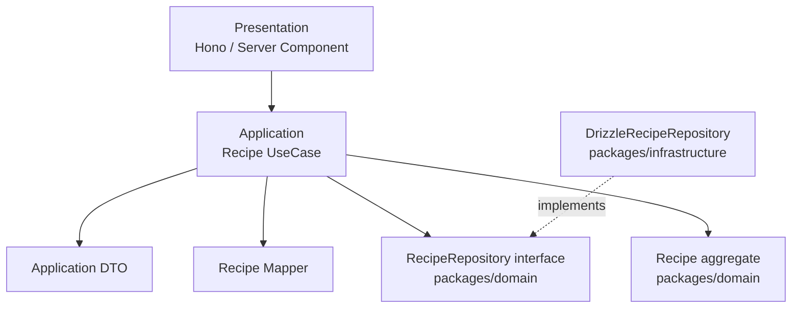

# Sprint 1 Recipe UseCase 実装計画

## 目的

Recipe 集約の CRUD 操作を Application 層の UseCase として実装する。

Sprint 1 では Recipe ドメイン層と Drizzle Repository が用意されたため、次の段階として Presentation 層から呼び出すための Application 層を整備する。UseCase は `RecipeRepository` を介して Recipe 集約を取得・保存・削除し、入出力はプレーンな DTO に変換する。

Clean Architecture の依存方向に従い、Application 層は Domain 層の Repository Interface と Entity / Value Object にのみ依存する。Drizzle や DB 行の型は Infrastructure 層に閉じ込め、Application 層には持ち込まない。

## ゴール

- `@cookpit/application` から Recipe CRUD 用 UseCase を利用できるようにする。
- UseCase は `RecipeRepository` をコンストラクタで受け取る手動 DI とする。
- UseCase の公開メソッドは `execute()` のみにする。
- Application 層の外へ `Recipe` エンティティを返さず、DTO を返す。
- ID 指定で Recipe が見つからない場合は `RecipeNotFoundError` を投げる。
- `packages/application/src/index.ts` から DTO・エラー・UseCase を export する。
- `pnpm --filter @cookpit/application type-check` が通る状態にする。
- 実装後に Claude Code へレビューを依頼する。

## スコープ

### 対象

- `packages/application/package.json`
- `packages/application/src/index.ts`
- `packages/application/src/recipe/recipe.dto.ts`
- `packages/application/src/recipe/recipe.mapper.ts`
- `packages/application/src/recipe/recipe-not-found.error.ts`
- `packages/application/src/recipe/create-recipe.use-case.ts`
- `packages/application/src/recipe/get-recipes.use-case.ts`
- `packages/application/src/recipe/get-recipe.use-case.ts`
- `packages/application/src/recipe/update-recipe.use-case.ts`
- `packages/application/src/recipe/delete-recipe.use-case.ts`

### 対象外

- Domain 層の修正
- Infrastructure 層の修正
- Hono ルーター実装
- UI 実装
- api-contract / Zod スキーマ実装
- `baseServings` 更新機能の追加
- Repository 統合テスト

## 前提

- `DrizzleRecipeRepository` は実装済みで、`RecipeRepository` インターフェースを実装している。
- `packages/domain/src/index.ts` は root export が整っていないため、今回も既存の `DrizzleRecipeRepository` と同じく Domain の個別ファイルを package subpath で import する。
- HTTP の raw input に対する Zod バリデーションは後続の `api-contract` / Hono 層で担当する。
- UseCase では Recipe の不変条件を再実装しない。バリデーションは `Recipe.create()`、`RecipeIngredient.create()`、`Quantity.of()`、`CookingStep` の constructor、Recipe の更新メソッドに委ねる。
- `Recipe` には `baseServings` の更新メソッドが存在しないため、Update DTO では `baseServings` を扱わない。

## 作成・変更ファイル

```text
packages/application/
├── package.json                         # @cookpit/domain dependency を追加
└── src/
    ├── index.ts                         # public export を更新
    └── recipe/
        ├── recipe.dto.ts                # 新規作成
        ├── recipe.mapper.ts             # 新規作成
        ├── recipe-not-found.error.ts    # 新規作成
        ├── create-recipe.use-case.ts    # 新規作成
        ├── get-recipes.use-case.ts      # 新規作成
        ├── get-recipe.use-case.ts       # 新規作成
        ├── update-recipe.use-case.ts    # 新規作成
        └── delete-recipe.use-case.ts    # 新規作成
```

## 関係図



## UseCase の責務

Recipe UseCase は以下のみを担当する。

- input DTO を Domain オブジェクトへ変換する。
- `Recipe.create()` または既存 Recipe の更新メソッドを呼び出す。
- `RecipeRepository` を通じて保存・取得・削除する。
- Domain オブジェクトを output DTO へ変換して返す。
- ID 指定の取得・更新・削除で対象が存在しない場合に `RecipeNotFoundError` を投げる。

UseCase には以下を書かない。

- Drizzle / DB 行の型
- HTTP status code への変換
- Zod による API 入力検証
- Recipe 名や材料量などのドメインバリデーションの再実装
- Product / MealPlan など他集約への参照解決

## 実装手順

### 1. `packages/application/package.json` に依存を追加

`@cookpit/domain` を workspace dependency として追加する。

```json
{
  "dependencies": {
    "@cookpit/domain": "workspace:*"
  }
}
```

追加後、workspace link を更新する。

```bash
pnpm install
```

### 2. `recipe.dto.ts` を作成する

DTO はプレーンな interface のみにする。`createdAt` / `updatedAt` は HTTP/JSON 境界で扱いやすいよう ISO 8601 文字列に変換する。

```typescript
import type { RecipeTag } from '@cookpit/domain/src/recipe/recipe';
import type { Unit } from '@cookpit/domain/src/shared/unit';

export interface RecipeIngredientDto {
  productRef: string | null;
  displayName: string;
  amountValue: number | null;
  amountUnit: Unit | null;
  amountNote: string | null;
}

export interface CookingStepDto {
  description: string;
}

export interface RecipeDto {
  id: string;
  name: string;
  baseServings: number;
  cookingTime: number | null;
  tags: RecipeTag[];
  notes: string;
  ingredients: RecipeIngredientDto[];
  steps: CookingStepDto[];
  createdAt: string;
  updatedAt: string;
}

export interface CreateRecipeInputDto {
  name: string;
  ingredients: RecipeIngredientDto[];
  steps: CookingStepDto[];
  baseServings: number;
  tags: RecipeTag[];
  cookingTime: number | null;
  notes: string;
}

export interface UpdateRecipeInputDto {
  id: string;
  name: string;
  ingredients: RecipeIngredientDto[];
  steps: CookingStepDto[];
  tags: RecipeTag[];
  cookingTime: number | null;
  notes: string;
}
```

### 3. `recipe.mapper.ts` を作成する

DTO と Domain オブジェクトの変換をまとめる。mapper は Application 層内部の実装詳細として扱い、`index.ts` から export しない。

```typescript
import { CookingStep } from '@cookpit/domain/src/recipe/cooking-step';
import { Recipe } from '@cookpit/domain/src/recipe/recipe';
import { RecipeIngredient } from '@cookpit/domain/src/recipe/recipe-ingredient';
import { Quantity } from '@cookpit/domain/src/shared/quantity';
import type { Unit } from '@cookpit/domain/src/shared/unit';
import type { CookingStepDto, RecipeDto, RecipeIngredientDto } from './recipe.dto';

function toQuantity(value: number | null, unit: Unit | null): Quantity | null {
  if (value === null || unit === null) {
    return null;
  }
  return Quantity.of(value, unit);
}

export function toIngredient(dto: RecipeIngredientDto): RecipeIngredient {
  return RecipeIngredient.create({
    productRef: dto.productRef !== null ? { value: dto.productRef } : null,
    displayName: dto.displayName,
    amount: toQuantity(dto.amountValue, dto.amountUnit),
    amountNote: dto.amountNote,
  });
}

export function toStep(dto: CookingStepDto): CookingStep {
  return new CookingStep(dto.description);
}

export function toRecipeDto(recipe: Recipe): RecipeDto {
  return {
    id: recipe.id.value,
    name: recipe.name,
    baseServings: recipe.baseServings,
    cookingTime: recipe.cookingTime,
    tags: recipe.tags,
    notes: recipe.notes,
    ingredients: recipe.ingredients.map(toIngredientDto),
    steps: recipe.steps.map(toStepDto),
    createdAt: recipe.createdAt.toISOString(),
    updatedAt: recipe.updatedAt.toISOString(),
  };
}

function toIngredientDto(ingredient: RecipeIngredient): RecipeIngredientDto {
  return {
    productRef: ingredient.productRef?.value ?? null,
    displayName: ingredient.displayName,
    amountValue: ingredient.amount?.value ?? null,
    amountUnit: ingredient.amount?.unit ?? null,
    amountNote: ingredient.amountNote,
  };
}

function toStepDto(step: CookingStep): CookingStepDto {
  return { description: step.description };
}
```

### 4. `recipe-not-found.error.ts` を作成する

後続の Hono 層で 404 にマッピングしやすいよう、専用エラーを定義する。

```typescript
export class RecipeNotFoundError extends Error {
  constructor(recipeId: string) {
    super(`Recipe not found: ${recipeId}`);
    this.name = 'RecipeNotFoundError';
  }
}
```

### 5. Create UseCase を作成する

```typescript
import { Recipe } from '@cookpit/domain/src/recipe/recipe';
import type { RecipeRepository } from '@cookpit/domain/src/recipe/recipe.repository';
import type { CreateRecipeInputDto, RecipeDto } from './recipe.dto';
import { toIngredient, toRecipeDto, toStep } from './recipe.mapper';

export class CreateRecipeUseCase {
  constructor(private readonly recipeRepository: RecipeRepository) {}

  async execute(input: CreateRecipeInputDto): Promise<RecipeDto> {
    const recipe = Recipe.create({
      name: input.name,
      ingredients: input.ingredients.map(toIngredient),
      steps: input.steps.map(toStep),
      baseServings: input.baseServings,
      tags: input.tags,
      cookingTime: input.cookingTime,
      notes: input.notes,
    });

    await this.recipeRepository.save(recipe);

    return toRecipeDto(recipe);
  }
}
```

### 6. Get List UseCase を作成する

```typescript
import type { RecipeRepository } from '@cookpit/domain/src/recipe/recipe.repository';
import type { RecipeDto } from './recipe.dto';
import { toRecipeDto } from './recipe.mapper';

export class GetRecipesUseCase {
  constructor(private readonly recipeRepository: RecipeRepository) {}

  async execute(): Promise<RecipeDto[]> {
    const recipes = await this.recipeRepository.findAll();
    return recipes.map(toRecipeDto);
  }
}
```

### 7. Get Detail UseCase を作成する

```typescript
import { RecipeId } from '@cookpit/domain/src/recipe/recipe-id';
import type { RecipeRepository } from '@cookpit/domain/src/recipe/recipe.repository';
import type { RecipeDto } from './recipe.dto';
import { toRecipeDto } from './recipe.mapper';
import { RecipeNotFoundError } from './recipe-not-found.error';

export class GetRecipeUseCase {
  constructor(private readonly recipeRepository: RecipeRepository) {}

  async execute(id: string): Promise<RecipeDto> {
    const recipe = await this.recipeRepository.findById(RecipeId.fromString(id));
    if (recipe === null) {
      throw new RecipeNotFoundError(id);
    }

    return toRecipeDto(recipe);
  }
}
```

### 8. Update UseCase を作成する

既存 Recipe を取得し、ドメインの更新メソッドで変更してから保存する。`baseServings` は更新対象に含めない。

```typescript
import { RecipeId } from '@cookpit/domain/src/recipe/recipe-id';
import type { RecipeRepository } from '@cookpit/domain/src/recipe/recipe.repository';
import type { RecipeDto, UpdateRecipeInputDto } from './recipe.dto';
import { toIngredient, toRecipeDto, toStep } from './recipe.mapper';
import { RecipeNotFoundError } from './recipe-not-found.error';

export class UpdateRecipeUseCase {
  constructor(private readonly recipeRepository: RecipeRepository) {}

  async execute(input: UpdateRecipeInputDto): Promise<RecipeDto> {
    const recipe = await this.recipeRepository.findById(RecipeId.fromString(input.id));
    if (recipe === null) {
      throw new RecipeNotFoundError(input.id);
    }

    recipe.rename(input.name);
    recipe.updateIngredients(input.ingredients.map(toIngredient));
    recipe.updateSteps(input.steps.map(toStep));
    recipe.updateTags(input.tags);
    recipe.updateCookingTime(input.cookingTime);
    recipe.updateNotes(input.notes);

    await this.recipeRepository.save(recipe);

    return toRecipeDto(recipe);
  }
}
```

### 9. Delete UseCase を作成する

削除前に存在確認を行う。存在しない ID の削除を正常終了にしないことで、Presentation 層が 404 として扱えるようにする。

```typescript
import { RecipeId } from '@cookpit/domain/src/recipe/recipe-id';
import type { RecipeRepository } from '@cookpit/domain/src/recipe/recipe.repository';
import { RecipeNotFoundError } from './recipe-not-found.error';

export class DeleteRecipeUseCase {
  constructor(private readonly recipeRepository: RecipeRepository) {}

  async execute(id: string): Promise<void> {
    const recipeId = RecipeId.fromString(id);
    const recipe = await this.recipeRepository.findById(recipeId);
    if (recipe === null) {
      throw new RecipeNotFoundError(id);
    }

    await this.recipeRepository.delete(recipeId);
  }
}
```

### 10. `index.ts` を更新する

Application package の公開 API として DTO・エラー・UseCase を export する。`recipe.mapper.ts` は内部実装のため export しない。

```typescript
export * from './recipe/recipe.dto';
export * from './recipe/recipe-not-found.error';
export * from './recipe/create-recipe.use-case';
export * from './recipe/get-recipes.use-case';
export * from './recipe/get-recipe.use-case';
export * from './recipe/update-recipe.use-case';
export * from './recipe/delete-recipe.use-case';
```

## 型チェック

実装後に以下を実行する。

```bash
pnpm --filter @cookpit/application type-check
```

`package.json` に dependency を追加した後は、先に `pnpm install` を実行して workspace link を更新する。

## 注意事項

- `any` 型は使わない。必要な場合は `unknown` を検討する。
- デフォルトエクスポートは使わない。
- 型のみの import は `import type` を使う。
- `null` と `undefined` を混在させない。DTO の「値なし」は `null` に統一する。
- `===` / `!==` を使う。
- UseCase 内でドメインバリデーションを再実装しない。
- UseCase から Infrastructure の具象 Repository を import しない。
- `Recipe` エンティティを Presentation / Hono 層へ返さない。
- `RecipeNotFoundError` 以外のドメイン由来エラーは、Domain のファクトリや更新メソッドから投げられるものをそのまま上位へ伝える。
- `baseServings` の更新が必要になった場合は、Domain 設計変更が必要な別タスクとして扱う。

## 完了条件

- `packages/application/package.json` に `@cookpit/domain` が追加されている。
- `pnpm install` 済みで workspace link が更新されている。
- `recipe.dto.ts` が作成され、入出力 DTO が定義されている。
- `recipe.mapper.ts` が作成され、DTO と Domain の変換が実装されている。
- `recipe-not-found.error.ts` が作成されている。
- `CreateRecipeUseCase` / `GetRecipesUseCase` / `GetRecipeUseCase` / `UpdateRecipeUseCase` / `DeleteRecipeUseCase` が作成されている。
- 各 UseCase が `RecipeRepository` をコンストラクタ注入し、`execute()` のみを公開している。
- 入出力が DTO で完結し、`Recipe` エンティティが Application 層の外に漏れていない。
- `packages/application/src/index.ts` から DTO・エラー・各 UseCase が export されている。
- `recipe.mapper.ts` が package public API として export されていない。
- `pnpm --filter @cookpit/application type-check` がエラーなく通る。
- 実装後に Claude Code へレビュー依頼を行う。
