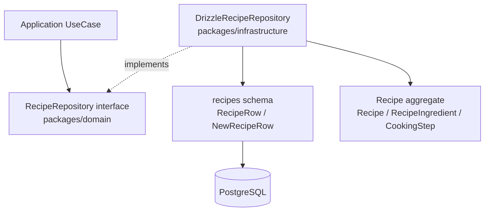

# Sprint 1 DrizzleRecipeRepository 実装計画

## 目的

Recipe 集約を Drizzle ORM 経由で PostgreSQL に保存・取得できるようにする。

Sprint 1 では Recipe ドメイン層と `recipes` テーブル定義が用意されたため、次の段階として Infrastructure 層に Repository 実装を追加する。この Repository は Domain 層の `RecipeRepository` インターフェースを実装し、DB 行とドメインモデルの変換責務を持つ。

Clean Architecture の依存方向に従い、Domain 層には Drizzle や DB の型を持ち込まない。永続化に関する詳細は `packages/infrastructure` に閉じ込める。

## ゴール

- `packages/infrastructure/src/db/client.ts` を作成し、DB クライアントをファクトリ関数で生成できるようにする。
- `packages/infrastructure/src/repositories/drizzle-recipe.repository.ts` を作成する。
- `DrizzleRecipeRepository` が `RecipeRepository` を実装する。
- `Recipe` / `RecipeIngredient` / `CookingStep` / `Quantity` と `RecipeRow` / `NewRecipeRow` の相互変換を実装する。
- `packages/infrastructure/src/index.ts` から DB スキーマ、DB クライアント、Repository を export する。
- `pnpm --filter @cookpit/infrastructure type-check` が通る状態にする。
- 実装後に Claude Code へレビューを依頼する。

## スコープ

### 対象

- `packages/infrastructure/src/db/client.ts`
- `packages/infrastructure/src/repositories/drizzle-recipe.repository.ts`
- `packages/infrastructure/src/index.ts`

### 対象外

- Domain 層の修正
- Application UseCase 実装
- Hono ルーター実装
- UI 実装
- Repository 統合テスト
- Product / MealPlan / ShoppingList / Pantry の Repository 実装

## 前提

- `packages/infrastructure/src/db/schema.ts` に `recipes` テーブルが定義済みである。
- `RecipeRow` / `NewRecipeRow` が `packages/infrastructure/src/db/schema.ts` から export 済みである。
- `packages/domain/src/index.ts` は現時点で root export が整っていないため、今回の実装では Domain の個別ファイルを package subpath で import する。
- DB クライアントはシングルトンではなく `createDb(databaseUrl)` のファクトリ関数として定義する。呼び出し側が `DATABASE_URL` を渡すことで、テスト時に差し替えやすくする。

## 作成・変更ファイル

```text
packages/infrastructure/src/
├── db/
│   ├── client.ts       # 新規作成
│   └── schema.ts       # 既存。RecipeRow / NewRecipeRow を利用
├── repositories/
│   └── drizzle-recipe.repository.ts  # 新規作成
└── index.ts            # 更新
```

## 関係図



## Repository の責務

`DrizzleRecipeRepository` は以下を担当する。

- `findById(id)` で `recipes.id` を条件に 1 件取得する。
- `findAll()` で `createdAt` 昇順の Recipe 一覧を取得する。
- `save(recipe)` で upsert する。
- `delete(id)` で `recipes.id` を条件に削除する。
- DB 行から `Recipe.reconstruct()` を通して Recipe を復元する。
- Recipe から `NewRecipeRow` へ変換する。

Repository にはドメインロジックを書かない。Recipe の不変条件は `Recipe.reconstruct()`、`RecipeIngredient.create()`、`Quantity.of()`、`CookingStep` の constructor に委ねる。

## JSONB 格納型

`ingredients` / `steps` は `jsonb` として保存されているため、Repository ファイル内にローカル型を定義する。外部 export はしない。

```typescript
type IngredientRow = {
  productRef: string | null;
  displayName: string;
  amountValue: number | null;
  amountUnit: string | null;
  amountNote: string | null;
};

type StepRow = {
  description: string;
};
```

## 実装コード

### `packages/infrastructure/src/db/client.ts`

```typescript
import { neon } from '@neondatabase/serverless';
import { drizzle } from 'drizzle-orm/neon-http';
import * as schema from './schema';

export function createDb(databaseUrl: string) {
  return drizzle(neon(databaseUrl), { schema });
}

export type DrizzleClient = ReturnType<typeof createDb>;
```

### `packages/infrastructure/src/repositories/drizzle-recipe.repository.ts`

```typescript
import { eq } from 'drizzle-orm';
import { CookingStep } from '@cookpit/domain/src/recipe/cooking-step';
import { Recipe, type RecipeTag } from '@cookpit/domain/src/recipe/recipe';
import { RecipeId } from '@cookpit/domain/src/recipe/recipe-id';
import { RecipeIngredient } from '@cookpit/domain/src/recipe/recipe-ingredient';
import type { RecipeRepository } from '@cookpit/domain/src/recipe/recipe.repository';
import { Quantity } from '@cookpit/domain/src/shared/quantity';
import type { Unit } from '@cookpit/domain/src/shared/unit';
import type { DrizzleClient } from '../db/client';
import { recipes, type NewRecipeRow, type RecipeRow } from '../db/schema';

type IngredientRow = {
  productRef: string | null;
  displayName: string;
  amountValue: number | null;
  amountUnit: string | null;
  amountNote: string | null;
};

type StepRow = {
  description: string;
};

export class DrizzleRecipeRepository implements RecipeRepository {
  constructor(private readonly db: DrizzleClient) {}

  async findById(id: RecipeId): Promise<Recipe | null> {
    const rows = await this.db
      .select()
      .from(recipes)
      .where(eq(recipes.id, id.value))
      .limit(1);

    const row = rows[0];
    if (!row) {
      return null;
    }

    return this.toEntity(row);
  }

  async findAll(): Promise<Recipe[]> {
    const rows = await this.db.select().from(recipes).orderBy(recipes.createdAt);
    return rows.map((row) => this.toEntity(row));
  }

  async save(recipe: Recipe): Promise<void> {
    const row = this.toRow(recipe);

    await this.db
      .insert(recipes)
      .values(row)
      .onConflictDoUpdate({
        target: recipes.id,
        set: {
          name: row.name,
          baseServings: row.baseServings,
          cookingTime: row.cookingTime,
          tags: row.tags,
          notes: row.notes,
          ingredients: row.ingredients,
          steps: row.steps,
          updatedAt: row.updatedAt,
        },
      });
  }

  async delete(id: RecipeId): Promise<void> {
    await this.db.delete(recipes).where(eq(recipes.id, id.value));
  }

  private toEntity(row: RecipeRow): Recipe {
    const ingredients = (row.ingredients as IngredientRow[]).map((ingredient) => {
      const amountUnit =
        ingredient.amountUnit !== null ? toUnit(ingredient.amountUnit) : null;
      const amount =
        ingredient.amountValue !== null && amountUnit !== null
          ? Quantity.of(ingredient.amountValue, amountUnit)
          : null;

      return RecipeIngredient.create({
        productRef:
          ingredient.productRef !== null ? { value: ingredient.productRef } : null,
        displayName: ingredient.displayName,
        amount,
        amountNote: ingredient.amountNote,
      });
    });

    const steps = (row.steps as StepRow[]).map(
      (step) => new CookingStep(step.description),
    );

    return Recipe.reconstruct({
      id: RecipeId.fromString(row.id),
      name: row.name,
      ingredients,
      steps,
      baseServings: row.baseServings,
      tags: row.tags.map((tag) => toRecipeTag(tag)),
      cookingTime: row.cookingTime,
      notes: row.notes,
      createdAt: row.createdAt,
      updatedAt: row.updatedAt,
    });
  }

  private toRow(recipe: Recipe): NewRecipeRow {
    const ingredients: IngredientRow[] = recipe.ingredients.map((ingredient) => ({
      productRef: ingredient.productRef?.value ?? null,
      displayName: ingredient.displayName,
      amountValue: ingredient.amount?.value ?? null,
      amountUnit: ingredient.amount?.unit ?? null,
      amountNote: ingredient.amountNote,
    }));

    const steps: StepRow[] = recipe.steps.map((step) => ({
      description: step.description,
    }));

    return {
      id: recipe.id.value,
      name: recipe.name,
      baseServings: recipe.baseServings,
      cookingTime: recipe.cookingTime,
      tags: recipe.tags,
      notes: recipe.notes,
      ingredients,
      steps,
      createdAt: recipe.createdAt,
      updatedAt: recipe.updatedAt,
    };
  }
}

function toUnit(value: string): Unit {
  switch (value) {
    case 'g':
    case 'kg':
    case 'ml':
    case 'l':
    case '大さじ':
    case '小さじ':
    case 'cup':
    case '個':
    case '本':
    case '枚':
    case '玉':
    case '尾':
    case '切れ':
    case '束':
    case '袋':
    case '缶':
    case '合':
      return value;
    default:
      throw new Error(`Unknown unit: ${value}`);
  }
}

function toRecipeTag(value: string): RecipeTag {
  switch (value) {
    case '主菜':
    case '副菜':
    case '汁物':
    case '作り置き向き':
    case '冷凍可':
      return value;
    default:
      throw new Error(`Unknown recipe tag: ${value}`);
  }
}
```

### `packages/infrastructure/src/index.ts`

```typescript
export * from './db/schema';
export * from './db/client';
export * from './repositories/drizzle-recipe.repository';
```

## 実装手順

1. `packages/infrastructure/src/db/client.ts` を作成する。
2. `createDb(databaseUrl)` と `DrizzleClient` 型を定義する。
3. `packages/infrastructure/src/repositories/` を作成する。
4. `drizzle-recipe.repository.ts` を作成する。
5. `IngredientRow` / `StepRow` を Repository ファイル内にローカル定義する。
6. `DrizzleRecipeRepository` を作成し、`RecipeRepository` を実装する。
7. `findById` / `findAll` / `save` / `delete` を実装する。
8. `toEntity(row)` / `toRow(recipe)` を実装する。
9. `packages/infrastructure/src/index.ts` に export を追加する。
10. 型チェックを実行する。

```bash
pnpm --filter @cookpit/infrastructure type-check
```

## 注意点

- Domain 層には Drizzle 型を持ち込まない。
- Repository は変換と永続化に集中し、ドメインロジックを書かない。
- `Recipe` の復元は必ず `Recipe.reconstruct()` を使う。
- `RecipeIngredient` の復元は必ず `RecipeIngredient.create()` を使う。
- `Quantity` の復元は必ず `Quantity.of()` を使う。
- `amount` と `amountNote` の排他制約は `RecipeIngredient.create()` に委ねる。
- JSONB のパース箇所以外では型アサーションを増やさない。
- 「値なし」は `null` に統一し、`undefined` を保存しない。

## 完了条件

- `packages/infrastructure/src/db/client.ts` が作成されている。
- `packages/infrastructure/src/repositories/drizzle-recipe.repository.ts` が作成されている。
- `DrizzleRecipeRepository` が `RecipeRepository` インターフェースを実装している。
- `findById` / `findAll` / `save` / `delete` が実装されている。
- `toEntity` / `toRow` で Recipe 集約と DB 行の相互変換ができる。
- `packages/infrastructure/src/index.ts` から必要な要素が export されている。
- `pnpm --filter @cookpit/infrastructure type-check` がエラーなく通る。
- 実装後に Claude Code へレビュー依頼を行う。
