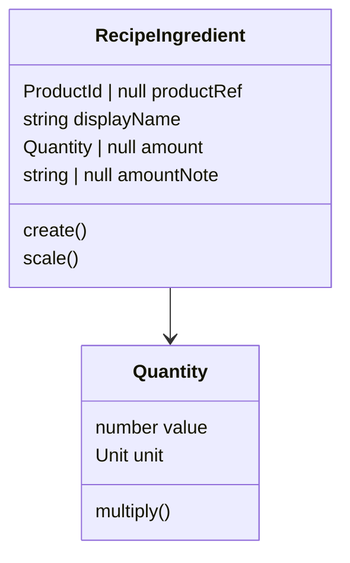

# Sprint 1 RecipeIngredient amountNote 実装ガイド

## 目標

`RecipeIngredient` で「少々」「適量」のような、数値と単位で表現できない材料量を扱えるようにする。

Sprint 1 の Recipe ドメイン実装に対する追加修正として、`amountNote` を導入し、`amount` を nullable にする。

## 目的

紙のレシピでは、材料量が必ずしも `100g` や `2 tbsp` のように数値化されているとは限らない。

MVP1 では紙レシピのデジタル化を優先するため、以下のような表現を無理に `Quantity` に変換しない。

- 少々
- 適量
- お好みで
- ひとつまみ

これにより、レシピ登録時の実用性を上げつつ、数量として扱える材料は引き続き `Quantity` で表現できる。

## 変更対象

変更対象は以下の 1 ファイルに限定する。

```text
packages/domain/src/recipe/recipe-ingredient.ts
```

`packages/domain/src/recipe/recipe.ts` は変更しない。

`Recipe.scaleIngredients()` は各 `RecipeIngredient.scale()` を呼ぶだけなので、`amount === null` の扱いは `RecipeIngredient` 側に閉じ込める。

## 実装方針

### フィールド

`RecipeIngredient` の内部フィールドを以下にする。

| フィールド              | 型                  | 説明                                          |
| ----------------------- | ------------------- | --------------------------------------------- |
| `productReference`      | `ProductId \| null` | Product 集約への ID 参照。未紐付けなら `null` |
| `ingredientDisplayName` | `string`            | レシピ上の材料名                              |
| `ingredientAmount`      | `Quantity \| null`  | 数値と単位で表現できる量                      |
| `ingredientAmountNote`  | `string \| null`    | 「少々」「適量」などの量メモ                  |

`ingredientAmount` と `ingredientAmountNote` は、どちらか一方だけを設定する。

両方 `null` は不可。両方に値がある状態も不可。

### Create Props

既存の `RecipeIngredientCreateProps` を以下の形に更新する。

```ts
export interface RecipeIngredientCreateProps {
  productRef: ProductId | null;
  displayName: string;
  amount: Quantity | null;
  amountNote: string | null;
}
```

`static create()` はこの interface を受け取る。

```ts
static create(props: RecipeIngredientCreateProps): RecipeIngredient
```

### バリデーション

`create()` では以下を検証する。

1. `displayName.trim() === ''` の場合は `Error`
2. `amount` と `amountNote` の両方がない場合は `Error`
3. `amount` と `amountNote` の両方がある場合は `Error`

判定は以下のようにまとめる。

```ts
const hasAmount = props.amount !== null;
const hasAmountNote = props.amountNote !== null && props.amountNote.trim() !== '';

if (hasAmount === hasAmountNote) {
  throw new Error('Either amount or amountNote is required');
}
```

この条件により、以下の状態を表現できる。

| amount     | amountNote | 結果 |
| ---------- | ---------- | ---- |
| `Quantity` | `null`     | OK   |
| `null`     | `'少々'`   | OK   |
| `Quantity` | `'少々'`   | NG   |
| `null`     | `null`     | NG   |
| `null`     | `''`       | NG   |

### scale の挙動

`scale(factor)` は `amount` の有無で挙動を変える。

`amount` が `Quantity` の場合は、既存どおり `amount.multiply(factor)` した新しい `RecipeIngredient` を返す。

```ts
return new RecipeIngredient(
  this.productReference,
  this.ingredientDisplayName,
  this.ingredientAmount.multiply(factor),
  null,
);
```

`amount` が `null` の場合は、`amountNote` による表現なので倍量計算しない。

```ts
if (this.ingredientAmount === null) {
  return this;
}
```

`RecipeIngredient` は immutable な Value Object として扱うため、`this` を返しても問題ない。

### Getter

公開する getter は以下。

```ts
get productRef(): ProductId | null;
get displayName(): string;
get amount(): Quantity | null;
get amountNote(): string | null;
```

`amount` の戻り値は `Quantity | null` に変更する。

## 完成イメージ

```ts
import type { Quantity } from '../shared/quantity';

export interface ProductId {
  readonly value: string;
}

export interface RecipeIngredientCreateProps {
  productRef: ProductId | null;
  displayName: string;
  amount: Quantity | null;
  amountNote: string | null;
}

export class RecipeIngredient {
  private constructor(
    private readonly productReference: ProductId | null,
    private readonly ingredientDisplayName: string,
    private readonly ingredientAmount: Quantity | null,
    private readonly ingredientAmountNote: string | null,
  ) {}

  static create(props: RecipeIngredientCreateProps): RecipeIngredient {
    if (props.displayName.trim() === '') {
      throw new Error('Display name is required');
    }

    const hasAmount = props.amount !== null;
    const hasAmountNote = props.amountNote !== null && props.amountNote.trim() !== '';

    if (hasAmount === hasAmountNote) {
      throw new Error('Either amount or amountNote is required');
    }

    return new RecipeIngredient(
      props.productRef,
      props.displayName,
      props.amount,
      props.amountNote,
    );
  }

  scale(factor: number): RecipeIngredient {
    if (this.ingredientAmount === null) {
      return this;
    }

    return new RecipeIngredient(
      this.productReference,
      this.ingredientDisplayName,
      this.ingredientAmount.multiply(factor),
      null,
    );
  }

  get productRef(): ProductId | null {
    return this.productReference;
  }

  get displayName(): string {
    return this.ingredientDisplayName;
  }

  get amount(): Quantity | null {
    return this.ingredientAmount;
  }

  get amountNote(): string | null {
    return this.ingredientAmountNote;
  }
}
```

## 関係図



## 気をつけなければいけないこと

- `recipe.ts` は変更しない
- `Recipe.scaleIngredients()` の責務を増やさない
- `amount` と `amountNote` の両方設定を許可しない
- `amount` と `amountNote` の両方未設定を許可しない
- `amountNote` が空文字の場合は未設定扱いにする
- `amountNote` は `string | null` とし、`undefined` は使わない
- 型だけの import は `import type` を使う
- `any` は使わない
- デフォルトエクスポートは禁止
- Domain 層に DB / HTTP / UI の型を持ち込まない

## つまづきそうなポイント

### 指示書のバリデーション例との差分

`docs/tasks/sprint1-recipe-ingredient-amountnote.md` のバリデーション例は、両方 `null` の禁止に寄っている。

ただし仕様本文では「amount と amountNote はどちらか一方のみ設定する」とあるため、このガイドでは両方設定も禁止する。

### `scale()` で `this` を返すこと

`amountNote` は「少々」「適量」のような非数値表現なので、倍量計算しない。

`RecipeIngredient` は immutable な Value Object なので、`amount === null` の場合に `this` を返してよい。

将来、同一参照を避けたい理由が出た場合は、同じ値を持つ新しい `RecipeIngredient` を返す実装に変更できる。

### 既存の呼び出し側

`RecipeIngredient.create()` の入力に `amountNote` が必須になるため、既存の呼び出し側がある場合は `amountNote: null` を追加する。

Sprint 1 時点で呼び出し側がテストやサンプルだけなら、そこも合わせて更新する。

### 完了条件のコマンド

タスク指示書では `@repo/domain` とあるが、このリポジトリの package name は `@cookpit/domain`。

確認コマンドは以下を使う。

```bash
pnpm --filter @cookpit/domain lint
pnpm --filter @cookpit/domain type-check
```

## 完了条件

- `RecipeIngredientCreateProps.amount` が `Quantity | null` になっている
- `RecipeIngredientCreateProps.amountNote` が追加されている
- `RecipeIngredient` が `ingredientAmountNote` を持っている
- `create()` が displayName / amount / amountNote の不変条件を検証している
- `scale()` が `amount === null` の場合に倍量計算しない
- `amount` getter が `Quantity | null` を返す
- `amountNote` getter が追加されている
- `recipe.ts` が変更されていない
- `pnpm --filter @cookpit/domain lint` が成功している
- `pnpm --filter @cookpit/domain type-check` が成功している
- 実装後に Claude Code へレビュー依頼を行っている
